# Nearby Car Service

## Seraby Car Service is an mobile app helpfull in searching best car workshop in your town.
Application is dedicated for client, owners and employees.

* The main purpose of the application: help in finding a car repair shop in the area
* App distinguish between 3 types of users (workshop owner, workshop employee, customer)
* Traditional login / registration or via Google account

Software use cases:
* Common use cases:
  * Sign In
  * Register
  * Edit profile
* Sample use cases for workshop owners:
  * Create a workshop
  * Edit workshop information
  * Delete Workshop
  * Add / remove employee (send/accept invitation)
  * Add / edit / remove service in the company's offer
  * View service orders (shipped by customers)
  * Accept the order and accept it for execution by the workshop
  * Change the order status ("accepted for execution, deliver the vehicle", "in progress", "ready, pick up the vehicle")
  * Answer clients' questions according to their orders
* Sample use cases for an employee:
  * Change the order status ("accepted for execution, deliver the vehicle", "in progress", "ready, pick up the vehicle")
  * Answer clients' questions according to their orders
  * Search your workplace workshop and sent a request to join
* Sample use cases for the client
  * Search for a workshop
  * See the workshop offer
  * See your orders history
  * Send a question to an employee about the current offer
  * Add /edit / remove your cars (name, model, petrol type production year)
  * Place an order for the service
  * Pay for order

Below some screens of most important views:

<table>
  <tr>
    <td>Log in view</td>
    <td>Sign in view</td>
    <td>User sidebar</td>
    <td>User profile form</td>
  </tr>
  <tr>
    <td>User's cars (client view)</td>
    <td>Add car form (client view)</td>
    <td>Edit car form (client view)</td>
  </tr>
  <tr>
    <td>Search workshop - map (client view)</td>
    <td>Workshop main view deatils (client view)</td>
    <td>Create order - first step pick services (client view)</td>
    <td>Create order - last step pick summary (client view)</td>
  </tr>
  <tr>
    <td>Orders list (client view)</td>
    <td>Order details (client view)</td>
    <td>Pay for order - summary (client view)</td>
    <td>Pay for order - add card (client view)</td>
  </tr>
  <tr>
    <td>Orders list (employee/wner view)</td>
    <td>Order details (employee/wner view)</td>
    <td>Employees list (employee/wner view)</td>
    <td>Workshop view (employee/wner view)</td>
  </tr>
  <tr>
    <td>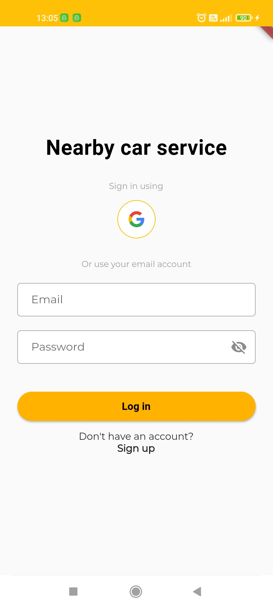</td>
    <td>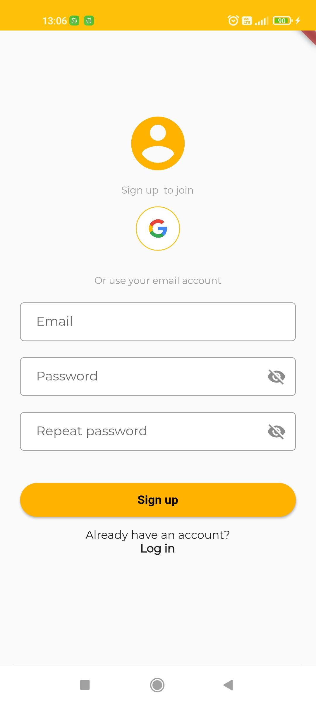</td>
    <td>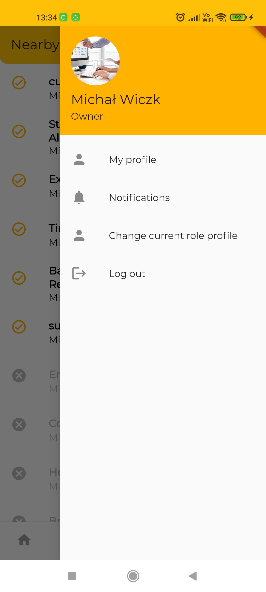</td>
    <td>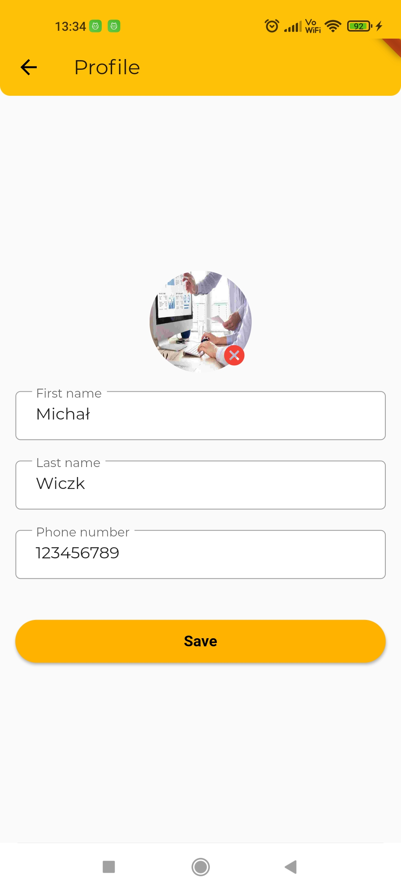</td>
  </tr>
  <tr>
    <td>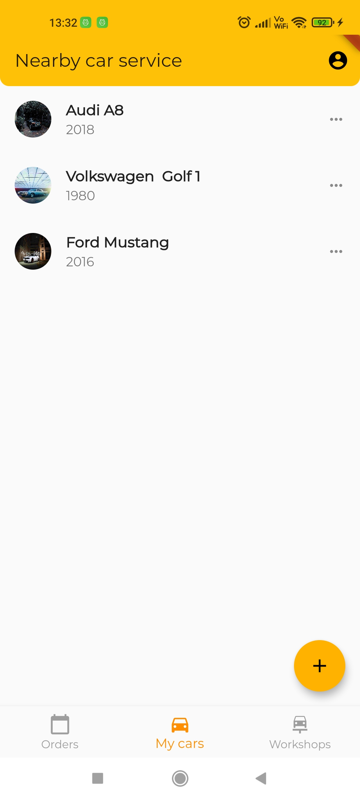</td>
    <td>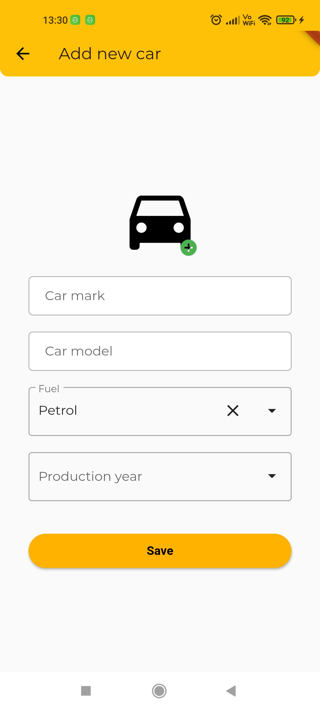</td>
    <td>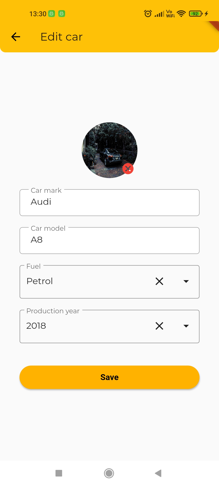</td>
  </tr>
   <tr>
    <td>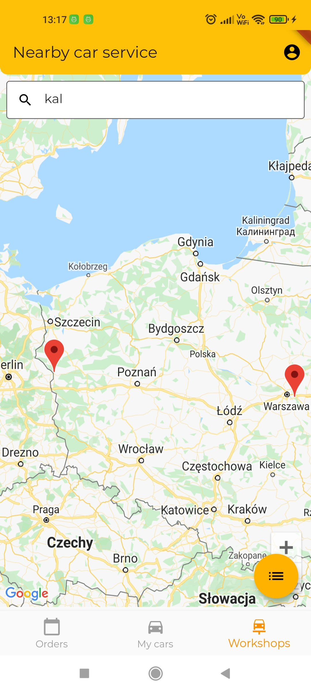</td>
    <td>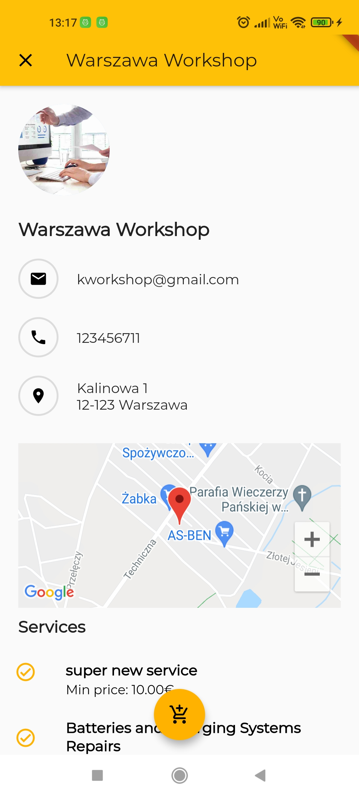</td>
    <td>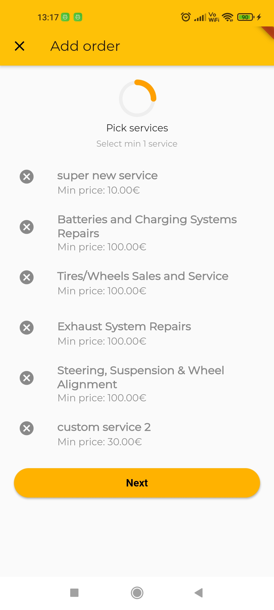</td>
    <td>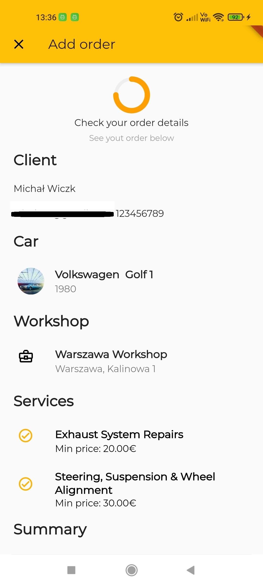</td>
  </tr>
    <td>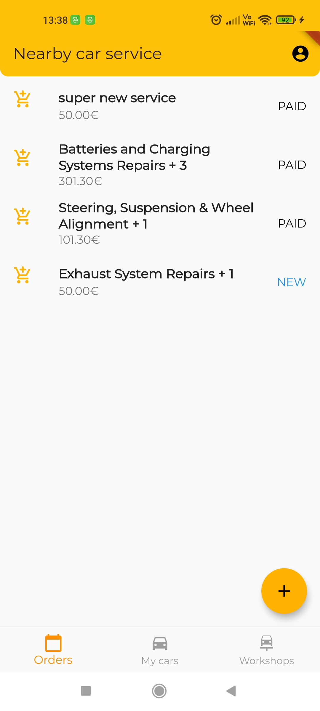</td>
    <td>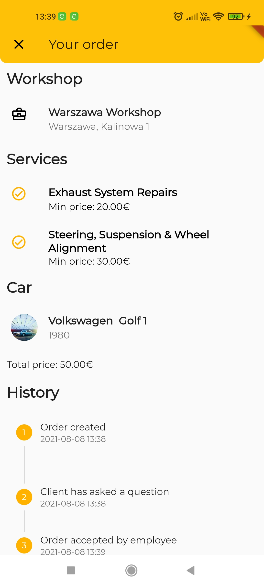</td>
   <td>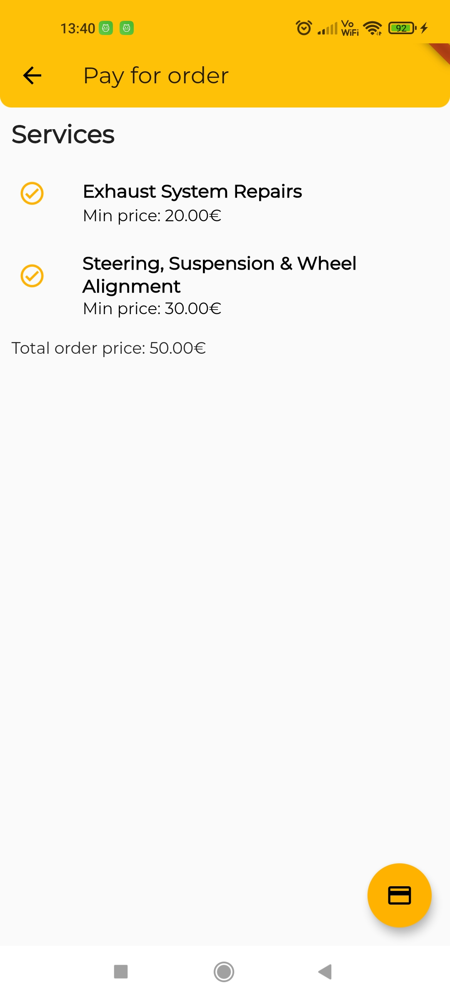</td>
   <td>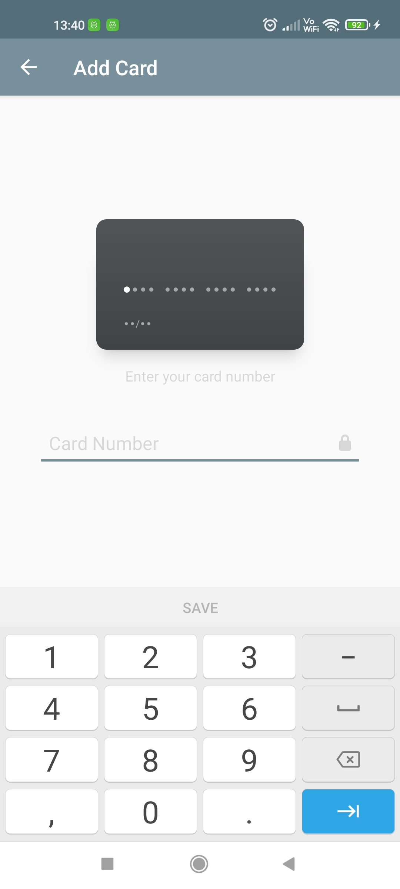</td>
  </tr>
   </tr>
    <td>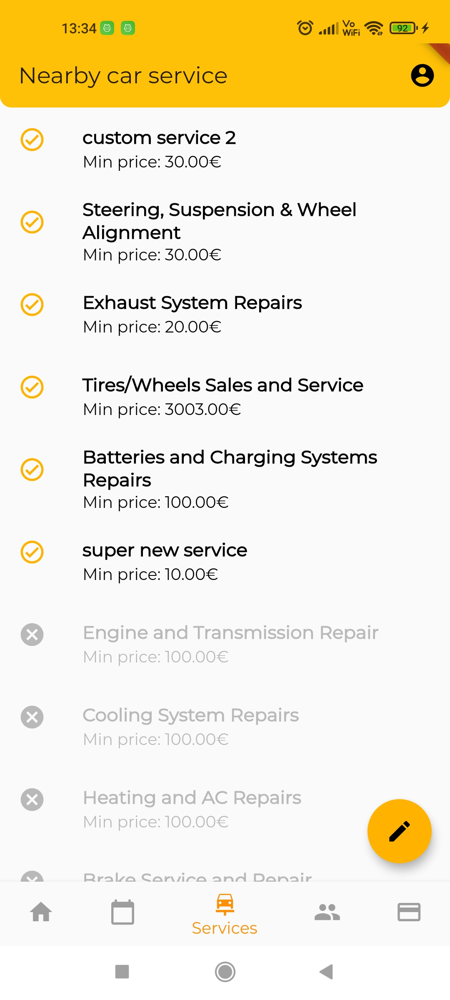</td>
    <td>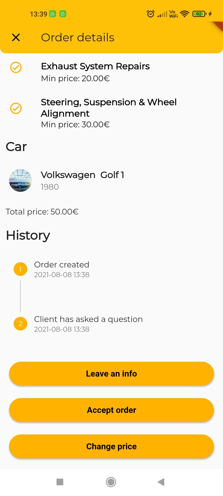</td>
   <td>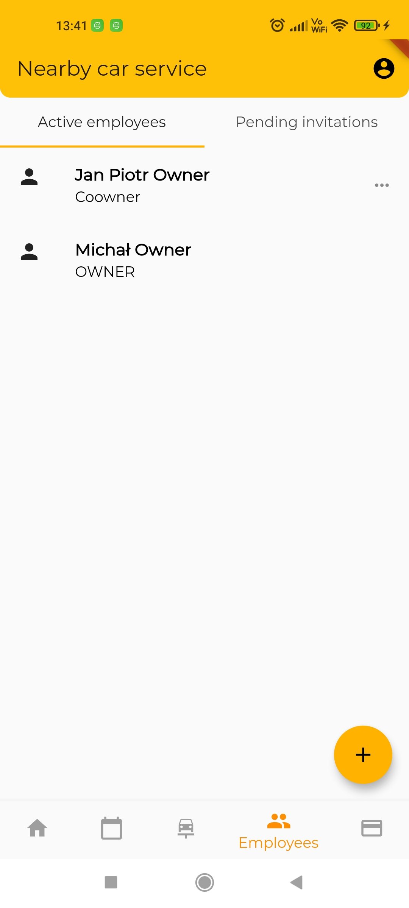</td>
   <td>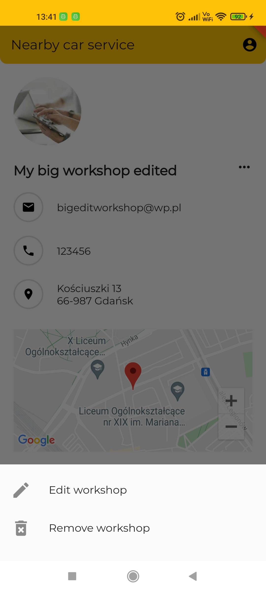</td>
  </tr>
 </table>

### Flutter template

It's a Flutter frmaework based app, using Dart programming language. For payments testig purpouse [Square](https://squareup.com/us/en) payment provider was used add customised Node.js simple server created. 

### Getting Started

This project is a starting point for a Flutter application.

A few resources to get you started if this is your first Flutter project:

- [Lab: Write your first Flutter app](https://flutter.dev/docs/get-started/codelab)
- [Cookbook: Useful Flutter samples](https://flutter.dev/docs/cookbook)

For help getting started with Flutter, view our
[online documentation](https://flutter.dev/docs), which offers tutorials,
samples, guidance on mobile development, and a full API reference.
